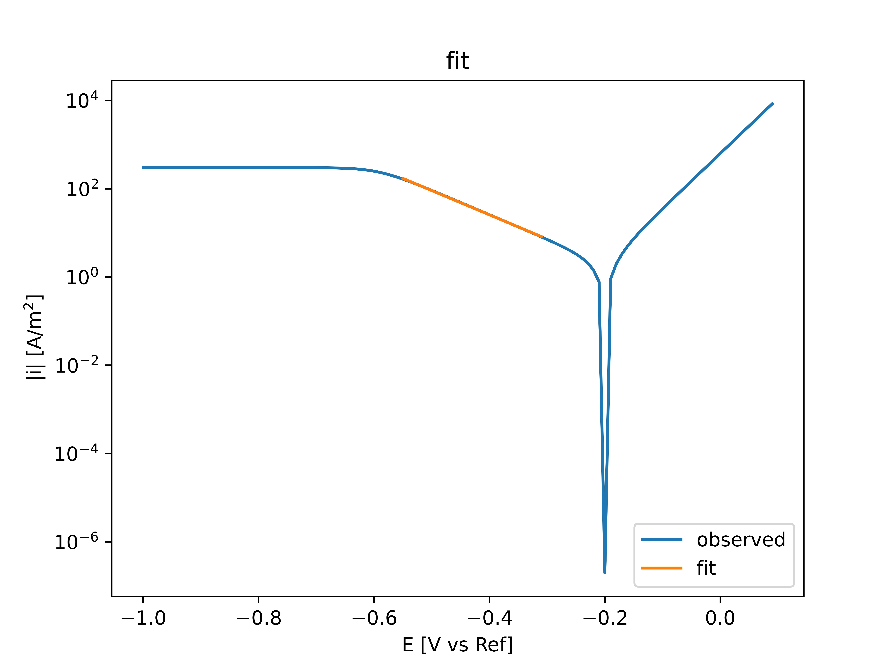
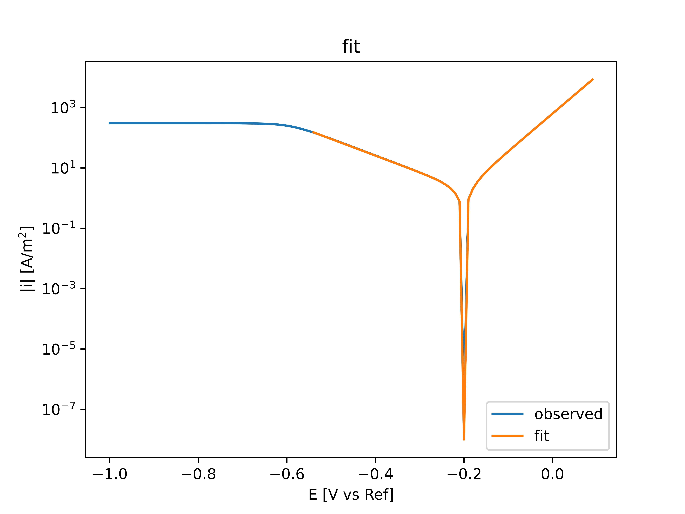
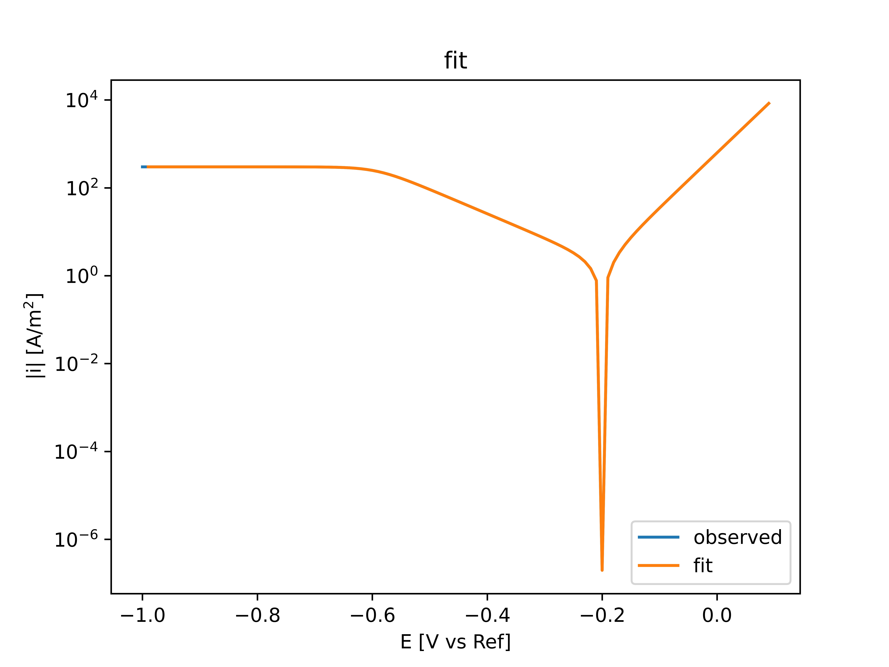

==============
Methodology
==============

PolCurveFit implements three different fitting techniques: Tafel extrapolation (linear fit), activation control fit & mixed activation-diffusion control fit. These techniques fit a theoretical curve to the polarization curve data. Below a short overview overview of the used theoretical curves for each technique. For more information, please refer to van Ede & Angst (2022).

*van Ede, Meeke, and Ueli Angst. "Analysis of polarization curves under mixed activation-diffusion control–an algorithm to minimize human factors." CORROSION (2022): 4171.* 'https://doi.org/10.5006/4171 <https://doi.org/10.5006/4171>'_ *

Initialisation and correction of the polarization curve
=======================================================

When the polarization curve object is initialised, the user has the possibility to correct the data. Firstly, by giving the electrolyte resistance R as an input, the potentials (E) are corrected for the IR drop:

.. math::

   E = E - I*R

Where I is the current. Secondly the user can specify the surface area of the sample, to be able to convert from currents to current densities. If the input data consists of current densities already, simply use the default value of 1.

Tafel extrapolation (linear fit)
================================
The Tafel extrapolation technique fits a linear line to the polarization curve data within a specified window. The technique is suitable for data that is solely under activation control on the  anodic or on the cathodic branch. This means that only one branch (the cathodic or anodic) can be fitted at a time. If The corrosion potential is given as an input, the fitted Tafel line is extrapolated to also obtain the corrosion current (density). 
Finally, one can also obtain the exchange current density, also extrapolated from the Tafel slope. An input value for the reversible potential of the fitted branch is required in this case.

Activation control fit
======================
This technique is suitable to fit currents around the corrosion potential, which are under activation control. It fits the following potential-current density, :math:`E-i`, relation to the polarization curve data:

.. math::
   
   	i = i_{corr}\left[ \exp\left(\frac{E-E_{corr}}{\beta_{an}}\right)  - \exp\left(\frac{E_{corr}-E}{\beta_{cath}}\right) \right]

where :math:`i_{corr}` is the corrosion current density, :math:`E_{corr}` the corrosion potential, :math:`\beta_{an}` the anodic Tafel slope and :math:`\beta_{cath}` the cathodic Tafel slope.

The theoretical curve is fitted in a by the user specified window [V vs :math:`E_{corr}`]. If the fit is not satisfactory, it might be important to give a good initial guess for the corrosion current density.

Finally, one can also obtain the exchange current densities, extrapolated from the Tafel slopes. Input values for the anodic and cathodic reversible potentials are required in this case.

Mixed activation-diffusion control fit
======================================
This technique is suitable for polarization curve data of which the cathodic branch is under mixed activation-diffusion control. It fits the following potential-current density, :math:`E-i`, relation to the polarization curve data:

.. math::

   i = i_{corr} * \exp{\frac{2.303(E-E_{corr})}{\beta_{an}}} -  \left[ \frac{\left( i_{corr}\exp{\frac{2.303(E_{corr}-E)}{\beta_{cath}}}\right)^\gamma}{1+\left(\frac{i_{corr}}{i_{L}}\exp{\frac{2.303(E_{corr}-E)}{\beta_{cath}}}\right)^\gamma}              \right]^{\frac{1}{\gamma}}

where :math:`i_{corr}` is the corrosion current density, :math:`E_{corr}` the corrosion potential, :math:`\beta_{an}` the anodic Tafel slope, :math:`\beta_{cath}` the cathodic Tafel slope and :math:`i_{L}` the limiting current density.

The theoretical curve is fitted in a by the user specified window [V vs :math:`E_{corr}`]. For an accurate fit, it is important that part of the purely diffusion controlled domain (the plateau associated with :math:`i_{L}`) is included in the fitted data. If the fit is not satisfactory, it might be important to also give a good initial guess for the corrosion current density and the limiting current density. Alternatively, the function also allows the user to fix the limiting current density at a certain value. 

Finally, one can also obtain the exchange current densities, extrapolated from the Tafel slopes. Input values for the anodic and cathodic reversible potentials are required in this case.

The function also includes the option to use a specific weight distribution. In general this weight distribution improves the accuracy of the results and decreases the subjectivity associated with the choice of the measured cathodic range. Meaning, the result becomes independent on the range of the purely diffusion controlled domain (the plateau associated with :math:`i_{L}`) included in the fitting. 

The specific weight distribution gives data close to :math:`E_{corr}` (in range +/- :math:'w_{ac}' [V vs :math:`E_{corr}`]) a higher weight than data further away from the OCP. The weight is specified as a percentage of the total weight, W [%]. It is recommended to take a value of :math:'w_{ac}' smaller than half of the beginning of the purely diffusion controlled domain. W is generally taken between 50 to 95 %. 

To obtain correct settings for :math:'w_{ac}' and W, a sensitivity analysis can be performed, using the sensitivity analysis function of the library. This sensitivity analysis performs a multi parameter-sweep to obtain cathodic Tafel slopes, :math:`\beta_{cath}`, and limiting current densities, :math:`i_{L}`, for different combination of :math:'w_{ac}', W and the amount of total range of fitted cathodic potentials: the cathodic window :math:'w_c' [V vs :math:`E_{corr}`].

The goal is the to find the settings for :math:'w_{ac}' and W, for which the fitting results are the least dependent on the chosen potential range :math:'w_c'. This is quantified as the 'variability'. The smaller the variability, the less dependent the fitting results are on :math:'w_c'. The function plots first the mean and standard deviation of the variability (varied for :math:'w_{ac}') for each value of W. Here the optimal W is chosen corresponding to the minimum. Then for each W a plot is generated for the variability as a function of :math:'w_{ac}'. In the figure for the optimal W, the optimal value for :math:'w_{ac}' can be chosen, corresponding to the minimum variability.

Finally, to obtain a sense of uncertainty associated with the fit, the library contains a function to plot additional figures of the sensitivity analysis, which directly show the effect of W and :math:'w_{ac}' on the fitted :math:`\beta_{cath}` and :math:`i_{L}`.

For more detailed information about the sensitivity analysis, please refer to van Ede & Angst (2022):
*van Ede, Meeke, and Ueli Angst. "Analysis of polarization curves under mixed activation-diffusion control–an algorithm to minimize human factors." CORROSION (2022): 4171.* 'https://doi.org/10.5006/4171 <https://doi.org/10.5006/4171>'_ *