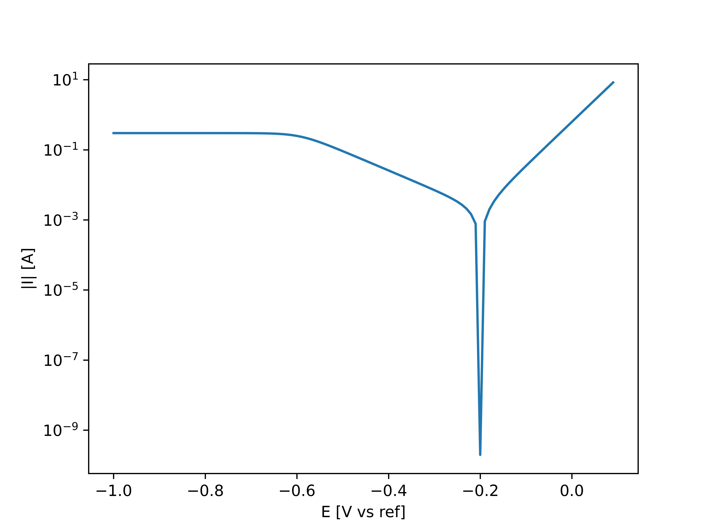
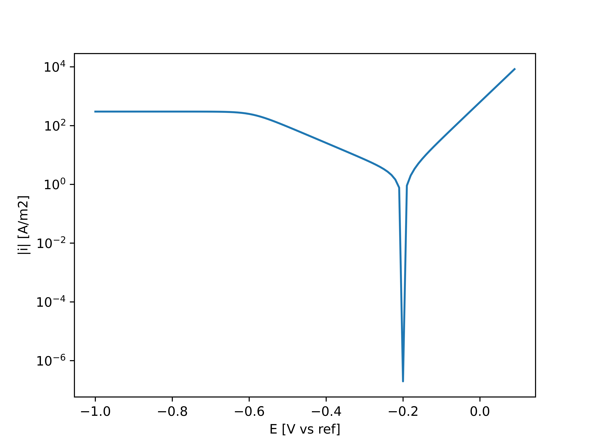

=================================================
Example 3: Mixed activation-diffusion control fit
=================================================

In this example, you will see how to apply 'the mixed activation-diffusion control fit' to your polarization curve. This technique can be applied for currents around the corrosion potential (OCP), of which the currents in the cathodic branch is under mixed activation-diffusion control. We will start with making an artificial Polarization curve:

.. code-block:: python
   
   >>> import numpy
   >>> I_corr = 0.002 	# The corrosion current [A]
   >>> E_corr = -0.2 	# The corrosion potential [V vs Ref]
   >>> b_a = 0.08 	# The anodic Tafel slope [V]
   >>> b_c = 0.18 	# The cathodic Tafel slope [V]
   >>> I_L = 0.3 	# The limiting current [A]
   >>> E = np.arange(-1.0, 0.1, 0.01)
   >>> I = I_corr * np.exp(2.3*(E-E_corr)/b_a) - (((I_corr*np.exp(2.3*(E_corr-E)/b_c))**3)/(1+((I_corr*np.exp(2.3*(E_corr-E)/b_c))/I_L)**3))**(1/3)

This example curve looks as following (in a semilogarithmic plot):

Now we initiate the polarization curve object. Here we get the option to correct the data for the IR drop, and convert the current into current density. Let's say the surface area corresponding to this artificial curve is 10 cm^2, and the IR-drop is negligible:

.. code-block:: python
   
   >>> from polcurvefit import PolCurveFit
   >>> Polcurve = PolCurveFit(E,I,sample_surface=10E-04)

We can visualise the corrected polarization curve

.. code-block:: python
   
   >>> plt.plot(Polcurve.E,np.abs(Polcurve.i))
   >>> plt.yscale('log')
   >>> plt.xlabel('E [V vs ref]')
   >>> plt.ylabel('|i| [A/m2]')
   >>> plt.show()

From the plot we can see that for this fitting technique we can include all currents. Note that it is important that the currents are only controlled by one cathodic and one anodic reaction. To perform the mixed activation-diffusion control fit, we need to specify the  window relative to the corrosion potential. Therefore:

.. code-block:: python
   
   >>> results = Polcurve.mixed_pol_fit(window=[-0.8,0.3])
   >>> print('The determined cathodic Tafel slope: ', results[4], '[V]')
   >>> print('The determined anodic Tafel slope: ', results[3], '[V]')
   >>> print('The determined corrosion current density: ', results[2], '[A/m2]')
   >>> print('The determined limiting current density: ', results[5], '[A/m2]')

   The determined cathodic Tafel slope:  -0.1800000000000017 [V]
   The determined anodic Tafel slope:  0.08000000000000007 [V]
   The determined corrosion current density:  2.000000000000054 [A/m2]
   The determined limiting current density:  299.99999999999983 [A/m2]

'results' includes also the fitted curve. This can used to manually visualise the results. However, this can  also be automatically done by using the following function, which saves the figures in the specified output folder:

.. code-block:: python
   
   >>> Polcurve.plotting(output_folder='Visualization_mixed_control_fit')

