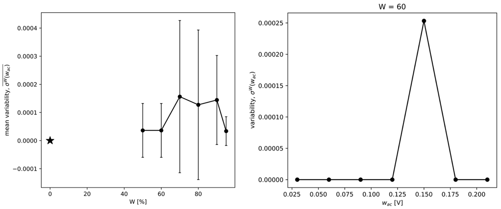

=================================================
Example 3: Mixed activation-diffusion control fit
=================================================

In this example, you will see how to apply 'the mixed activation-diffusion control fit' to your polarization curve. This technique can be applied for currents around the corrosion potential (OCP), of which the currents in the cathodic branch is under mixed activation-diffusion control. We will start with making an artificial Polarization curve:

.. code-block:: python
   
   >>> import numpy as np
   >>> I_corr = 0.002 	# The corrosion current [A]
   >>> E_corr = -0.2 	# The corrosion potential [V vs Ref]
   >>> b_a = 0.08 	# The anodic Tafel slope [V]
   >>> b_c = 0.18 	# The cathodic Tafel slope [V]
   >>> I_L = 0.3 	# The limiting current [A]
   >>> E = np.arange(-1.0, 0.1, 0.01)
   >>> I = I_corr * np.exp(2.3*(E-E_corr)/b_a) - (((I_corr*np.exp(2.3*(E_corr-E)/b_c))**3)/(1+((I_corr*np.exp(2.3*(E_corr-E)/b_c))/I_L)**3))**(1/3)

This example curve looks as following (in a semilogarithmic plot):

Now we initiate the polarization curve object. Here we get the option to correct the data for the IR drop, and convert the current into current density. Let's say the surface area corresponding to this artificial curve is 10 cm^2, and the IR-drop is negligible:

.. code-block:: python
   
   >>> from polcurvefit import polcurvefit as pcf
   >>> Polcurve = pcf(E,I,sample_surface=10E-04)

We can visualise the corrected polarization curve

.. code-block:: python
   
   >>> import matplotlib.pyplot as plt
   >>> plt.plot(Polcurve.E,np.abs(Polcurve.i))
   >>> plt.yscale('log')
   >>> plt.xlabel('E [V vs ref]')
   >>> plt.ylabel('|i| [A/m2]')
   >>> plt.show()

From the plot we can see that for this fitting technique we can include all currents. Note that it is important that the currents are only controlled by one cathodic and one anodic reaction. To perform the mixed activation-diffusion control fit, we need to specify the window relative to the corrosion potential. Therefore:

.. code-block:: python
   
   >>> results = Polcurve.mixed_pol_fit(window=[-0.8,0.3])
   >>> print('The determined cathodic Tafel slope: ', results[4], '[V]')
   >>> print('The determined anodic Tafel slope: ', results[3], '[V]')
   >>> print('The determined corrosion current density: ', results[2], '[A/m2]')
   >>> print('The determined limiting current density: ', results[5], '[A/m2]')

   The determined cathodic Tafel slope:  -0.1800000000000017 [V]
   The determined anodic Tafel slope:  0.08000000000000007 [V]
   The determined corrosion current density:  2.000000000000054 [A/m2]
   The determined limiting current density:  300.0000000000001 [A/m2]

We can now save the results (the fitted parameters and curve) to a text file:

.. code-block:: python

   >>> Polcurve.save_to_txt(filename = './results_mixed_control_fit')

The tuple 'results' includes also the fitted curve. This can used to manually visualise the results. However, this can  also be automatically done by using the following function, which saves the figures in the specified output folder:

.. code-block:: python
   
   >>> Polcurve.plotting(output_folder='Visualization_mixed_control_fit')

To obtain more accurate and less subjective results, we can apply a specific weight distribution, defined by the parameters w_ac and W (see Methodology):

.. code-block:: python
   
   >>> results = Polcurve.mixed_pol_fit(window=[-0.8,0.3], apply_weight_distribution = True, w_ac = 0.07, W = 80)

To obtain correct values for w_ac and W, we can perform a sensitivity analysis (see Methodology). Here we have to give as input w_dc, indicating at which potential [vs :math:'E_{corr}'] the purely diffusion controlled domain starts. For our curve this is at approximately -0.22 V vs :math:'E_{corr}'.

.. code-block:: python
   
   >>> results = Polcurve.sens_analysis(window=[-0.8,0.3], w_dc = -0.22, W=np.array([50, 60, 70, 80, 90, 95, 0]), w_ac=[0.03,0.06,0.09,0.12])

From the plots generated, one can tell that the variability of the fitting results as a function of the chosen potential range is very small for this theoretical curve, and the choice for W and w_ac are quite arbitrary. Similar/more stable results are reached by not applying the weight distribution. In the case that the fitting is dependent on accurate settings of W and w_ac, to get a sense of the actual uncertainty associated to our fit, additional figures can be plotted:

.. code-block:: python
   
   >>> Polcurve.plotting_sens_analysis()

